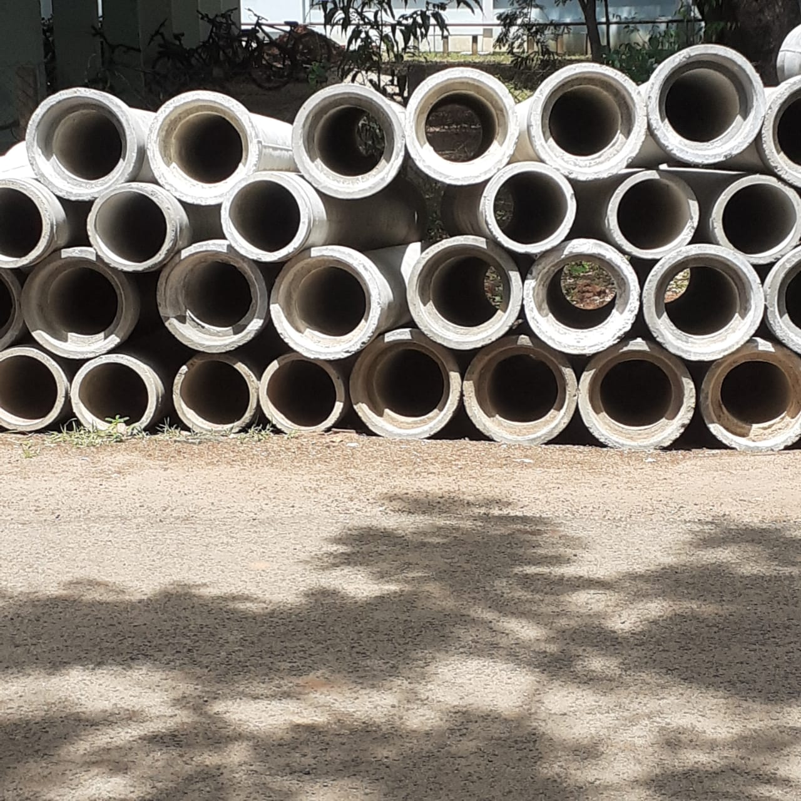
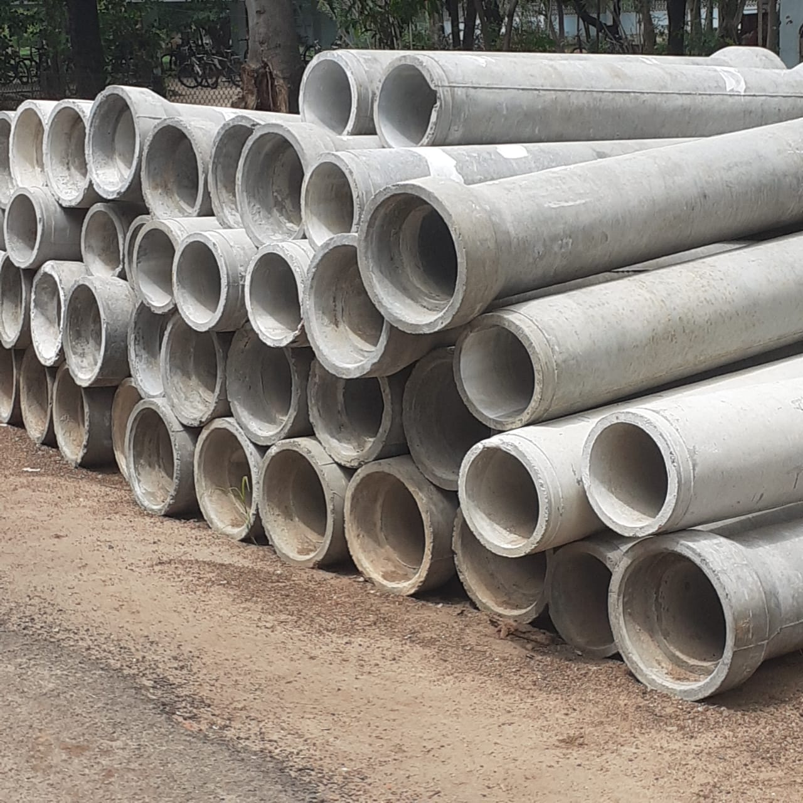
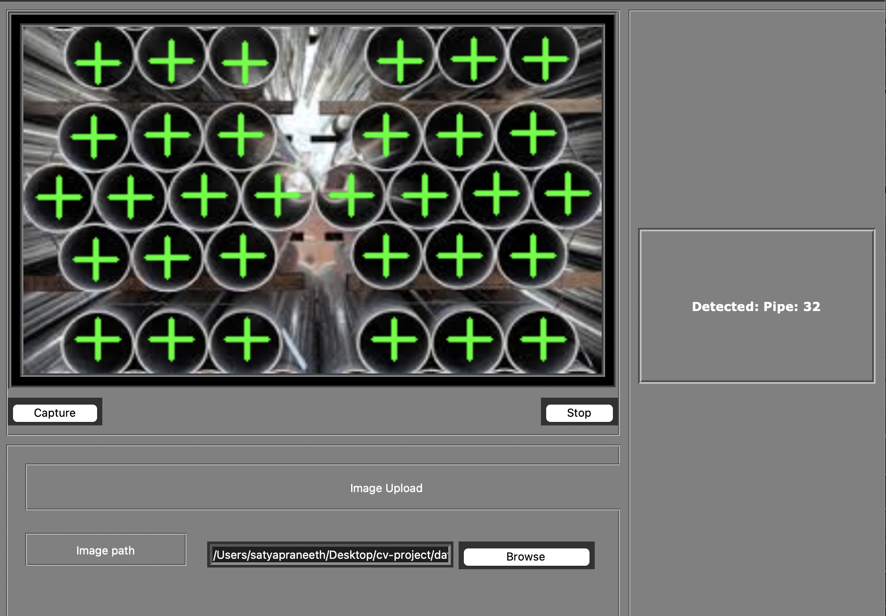

# PipeCounterAI
An AI-powered tool for counting pipes in images and videos using YOLOv8, trained on a custom dataset. This project leverages deep learning object detection techniques to identify and count pipes in diverse visual scenes accurately,


## Features
- Detects and counts pipes in images and video files.
- Built using YOLOv8 on a custom dataset for high accuracy.

## Installation

### 1. Clone the Repository
```bash
git clone https://github.com/SatyaP999/PipeCounterAI.git
cd PipeCounter
```
### 2. Creata a Conda Environment
```bash
conda create -n myenv python=3.8
conda ctivate myenv
```
### 3. Install Dependencies
```bash
pip install -r requirements.txt
```

## Dataset
- The model was trained on a custom dataset of images containing pipes. I have added the sample images.
- Sample Image 1

- Sample Image 2


## Usage
- Counting pipes in an image or video.
```bash
python app.py
```

## Model Training
- Prepare your dataset in YOLO format. If you have a dataset in COCO format use the JsonToTxt.py file to convert it.
- Follow the below folder structure
```markdown
root/
|-- dataset
|   |-- train
|        |- images
|        |- labels
|   |-- val
|        |- images
|        |- labels
```
- Now mention the path of the images folders of the train and the value in the data.yaml file. You can also add test data if you want.

## Demo


## License
This project is licensed under the MIT License.
